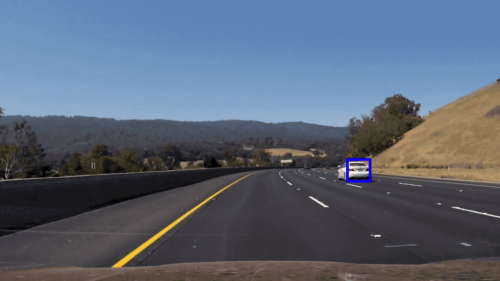

# Vehicle Detection Project with HOG and Linear SVC - Luca Fiaschi

The goal of this project is to write a software to reliably detect cars in a video.
The steps/ techniques used in  this project are the following:

* Perform feature extraction (Histogram of Oriented Gradients (HOG), colors and spatial features) on a labeled training set of images and train a classifier (Linear SVM)
* Implement a sliding-window technique to search for vehicles in images at multiple locations and scales.
* Run a pipeline on a video stream and use non-maxima suppression technique to suppress false positive and multiple detections.
* Estimate a bounding box for vehicles detected.

The code is organized as follows:

* The functions and classes used in the project are implemented in the library `detectlib`. This library is composed of three files: 
    * `features.py` which contains functions to import the data and extract features
    * `sliding_windows.py` which contains code to run a sliding window search at single scale. 
    * `tracker.py` which contains the main class to perform car  detection called `CarTracker`. This class implements sliding window search at multiple scales, false positive suppression and 
   temporal smoothing.
* To train the classifier a separated script is provided `bin/train.py`. The script produces a pickled file `model.p` containing the trained classifier and
the parameters to extract the features (such as the scale of the HOG filters)

* The output video is saved in `output.mp4` and can be obtained by running the script `detect.py`

[//]: # (Image References)
[image1]: ./output_images/random_samples.png
[image2]: ./output_images/hog_2.png
[image3]: ./output_images/hog_1.png
[image4]: ./output_images/confusion_matrix.png
[image5]: ./output_images/pipeling_0.png
[image6]: ./output_images/pipeling_5.png



---
## Histogram of Oriented Gradients (HOG)

#### 1. Feature extraction and model training

The code to train the classifier is contained in the file `bin/01_train.py` and in the library `detectlib`  

I started by reading in all the `vehicle` and `non-vehicle` images.  Here some example of one of each of class:

![alt text][image1]

I then explored different  parameters (`orientations`, `pixels_per_cell`, and `cells_per_block` for the HOG filters.  
I grabbed random images from each of the two classes and displayed them to get a feel for what the `skimage.hog()` output looks like.

Here is an example using the `YCrCb` color space and HOG parameters of `orientations=8`, `pixels_per_cell=(8, 8)` and `cells_per_block=(2, 2)` for an 
image of the class vehicle:

As we can see some image features such as the back-lights appear clearly in the HOG image as they have a particular signature of the
gradient.

![alt text][image2]

Here is an example using the color space and paramters for a random patch:

![alt text][image3]

No clear pattern appear in the HOG image.


####2-3. Feature selection and model hyperparamters optimization 

I split the set of images randomly into a training and test set. On the training set I performed cross validation multiple different combinations of parameters
for the feature extraction. The classifier used was a linear SVM as it is reported to work well in combination with HOG features and it is fast at prediction time. 
The final classifier accuracy on the test set was above 99% and the best set of parameters obtained with this procedure is the following:

```python
LinearSVC(C=10, class_weight=None, dual=True, fit_intercept=True,
     intercept_scaling=1, loss='hinge', max_iter=1000, multi_class='ovr',
     penalty='l2', random_state=None, tol=0.0001, verbose=0)
```

Here is the confusion matrix for the prediction was, as we can see the classifier is quite accurate.

![alt text][image4]


### Sliding Window Search

####1. Implementation and choice of scales.

Sliding window search is implemented in the library `detectlib/sliding_windows.py`. In order to speed up HOG feature computations
at multiple locations I used which is implemented a strategy which reuses HOG blocks across the entire images.

In order to choose the correct set of scales for the search I extracted 1 smaller video sequence from the longer video comprising
100 consecutive frames with the challenging situation of the two car surpussing the another.

I used these frames and by trial and error optimised the parameters for the detector on this small sequence.

My final implementation for combines detections across 4 different scales [0.8, 1.5, 3, 6] in order to detect both close by
and far away vehicles. To speed up computations, the 4 different scales are searched in parallel using the parallelization libary `joblib`.

---

### Video Implementation


####2. Describe how (and identify where in your code) you implemented some kind of filter for false positives and some method for combining overlapping bounding boxes.

I recorded the positions of positive detections in each frame of the video. From the positive detections I created a heatmap and then thresholded that map to identify vehicle positions.
I then used `scipy.ndimage.measurements.label()` to identify individual blobs in the heatmap.  
I then assumed each blob corresponded to a vehicle.   I constructed bounding boxes to cover the area of each blob detected.  

In order to remove small detections which are due to false positive or from the detector firing at the wrong scale I used two different techniques

 - Temporal smoothing: the heatmaps are integrated over 5 timesteps before being tresholded (implemneted in the class `CarTracker`). This allows to make the detections more
 stable across time
 - Size thresholding: detection smaller than a certain size are removed. The two different minimum size thresholds are implemneted for close and far away detections
 as it is shown in the function `remove_small_detections` of the file `tracker.py`
 - Spatial Smoothing: the heatmaps are filtered with a gaussian filter of sigma 4

Here's an example result showing the heatmap and the detections from a frame in the video.


![alt text][image5]

The next set of images refers to a frame which is 5 timestep later, and we can see that that the temporally integrated
heatmap helps identifying the detections.

![alt text][image6]

---

###Discussion

The car tracker does a very good job in identifying cars when they are one far apart from each other.

However, car which are overalpping (surpassing) are hard to tell apart. Also before the car is correctly detected it
needs to be almost entirely in the field of view and while the car is entering this area is not detected or detected
as multiple almost overallapping objects.

Onother, problem is is to optimize the throughput of the car detector.  In fact, in order to be usable in real conditions it needs to be able to provide the detections in almost real time.
